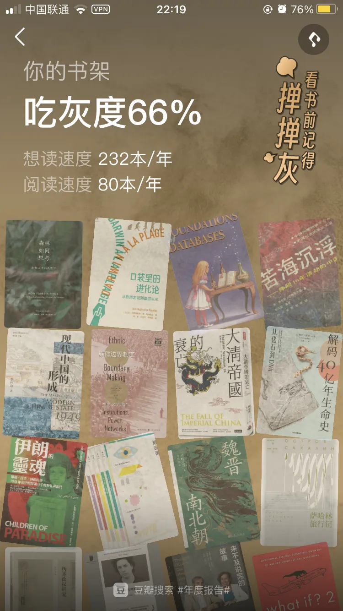

看过一个说法，年龄越大越能感觉到时光飞逝，因为一年这个分子不变，而我们年龄越来越大，所以1/年龄这个值越来越小，所以在体感上总会感觉到这一年过得真快啊。23年也是如此，快是快，但它依然是365天，52周。一年下来孩子们长大了不少，头发变少了，但年初期望好转的大环境非但没变好还变得更差，焦虑是一点没少，当然不变的还有读书。

今年依然是读了不少闲书，这些阅读见证了我的那些车上、厕上、带娃以、失眠以及其他琐碎的时间，犹豫了很久，决定还是整理出来，以记录这些被拼凑起来的碎片时间。

## 非虚构
非虚构依然占大头，当然也是因为非虚构是个筐，啥都往里装。

### 政治
- 《可能性的艺术》

- 《 国家的常识 : 政权·地理·文化》

《可能性的艺术》豆瓣9.2分严重虚高，有刘瑜老师的光环和下架的加成。毕竟是课程转的书，读起来略水，内容也是比较入门的科普。相对来说《国家的常识》内容要丰富一些，更全面地介绍了十几个国家的政权、地理与政治文化，包括发达国家与发展中国家。但却没那么好读了。

- 《独裁者手册》

太精彩了，纠正了好几个自以为是常识性的认知。政治可真是一门艺术啊，怪不得自古以来人们对权力的游戏乐此不疲。

- 《中国国家治理的制度逻辑》

其实这本只读了一半，太硬核对我来说超纲了实在看不下去，弃。

- 《小镇喧嚣》

很精彩的田野调查，真实地反应了基层的社会运作方式。乡村就是这样一个人情、熟人、吃喝的社会。书中所写的征收、迎检、征地、种房、邻里纠纷、产业调整。。。在中国任何一个乡镇都是这些事情，也是我从小看到大的身边事。因为书的内容是写于2003年-2004年，我觉得过去几十年乡镇最重要的事情计划生育书中并没有写，当然牵牛扒房的那些事写了也出版不了的。以及这三年乡镇的“抗疫”也是非常值得去书写的，如果能真实表现出来将会是非常值得思考的。

- 《乡土中国》

终于读了这本大名鼎鼎的书，实际上只是一本小册子。书中对我们这个农耕民族的文化传统和社会体系的描述足够透彻，不过毕竟写于70年前，最近10年移动互联网的出现和城市化建设的加速恐怕是改变了很多，至少在表面上是这样的。

### 历史
- 《汴京之围 : 北宋末年的外交、战争和人》

靖康耻犹未雪，春节那几天看的，那叫一个悲愤交加啊。

- 《盛世的崩塌 : 盛唐与安史之乱时期的政治、战争与诗》

- 《弃长安》

电影《长安三万里》搭配这两本书非常合适，在历史中穿插着那些诗人的故事，沉浸式体验他们的人生境遇，再次读那些耳熟能详的诗歌，别有一番体验。当然这是浪漫主义的视角，但我看这两本书的时候想到的更多是历史的悲哀，盛世崩于内斗，诗人死于乱世。

- 《翦商》

这本应该是很多人的年度top 1，在我这也差不多。看了整整一个月。对于缺乏上古历史背景的我来说有点难度有点震撼。但这书可太有意思了，立足考古大胆想象，牛逼。

- 《最早的帝国》

挺有意思的科普书，又好读。这样的好书被禁真是可惜可恨。

- 《季风之北，彩云之南 : 多民族融合的地方因素》

一定要看《流动的疆域》而不是这本，很好看，扩展历史视野。

- 《午夜北平 : （一）民国奇案1937 / （二）“恶土”，北平的堕落乐园》

故事很精彩，扣人心弦，一位少女被一些渣滓猎杀，但在那个时代背景下官方草草结案，老父亲凭借自己的能力去揭开真相。遗憾的是坏人最终也没有伏法，这个案子也成了历史悬案。在这个主线下也可以了解到抗战前北平侨民在中国大地上荒淫的生活，令人咂舌。

- 《恶魔之城 : 日本侵华时期的上海地下世界》

前面一本是北平洋人的地下生活，这本是上海洋人的地下生活。完全是另一个不为人知的世界，和我们了解到的老上海完全不一样，非常推荐。

- 《霓虹灯外 : 20世纪初日常生活中的上海》

“夜上海，夜上海，你是个不夜城，华灯起车声响歌舞升平”。受影视剧的影响，当我们提到二十世纪前40年的上海，我们想到的是这个歌舞升平的上海。但如果穿越回去，大概率不会是运筹帷幄的大商人、风度翩翩的公子、虎胆龙威的军官。而更大可能会是苦力、人力车夫、小市民。这本书就真实描写了这些普通人的生活，和他们的上海，他们的弄堂。

- 《打造消费天堂》

从《霓虹灯外》过来再看这本，感受到两个世界的参差。

- 《上海 : 1842—2010，一座伟大城市的肖像》

一本图册，快速翻阅了，从新老照片中看上海的百年变迁。

- 《漫长的余生》

通过一个普通宫女一生（寿命也真够长的，在那个时代86岁比现在106岁都难吧）为线索写北魏宫廷的斗争。政治从来都是一项危险的事业，越是高层越是如此，昨天还高朋满座，今天也许就人头落地。当然也是一项高收益的事业，所以人类们几千年来对政治趋之如鹜。作为本书主角的王钟儿，一位女性也被动挟裹到斗争的洪流当中。

- 《牛鬼蛇神》

杨小凯的自传，不可细说，人在某种环境下恶的程度远超想象。

- 《一滴泪》

巫宁坤先生的自传，豆瓣连条目都没有，普通人在大时代下只能默默忍受吗？我也不知道，每次看完这样的书都要难受好久。最近看到严锋老师的微博，更是感觉到背后发凉。

- 《一百年，许多人，许多事 : 杨苡口述自传》

在读库2106读过第一章。百岁老人一辈子的经历，遗憾的是杨老师在今年2月份去世了。

- 《与屠刀为邻 : 幸存者、刽子手与卢旺达大屠杀的记忆》

之前看《向您告知，明天我们一家要被杀》就已经非常窒息了，而这本对幸存者和刽子手的访谈更令人震惊，看到面对杀戮只能坐以待毙和狂热兽性的两个极端群体，从各自的立场去描述这件事，其实他们也想不明白为什么会发生。总之作为一个旁观者关于卢旺达大屠杀的书再也不想看了。

- 《娜塔莎之舞》

我们常说中国文化博大精深，那么俄国文化则是复杂多样，两级分化。彼得大帝全盘欧化、俄罗斯本土文化却极端传统，反个人主义，还有极端的政治化文化。在这样多样的文化中能建立大一统的苏联，既是奇迹也是共产主义的不可思议之处。

- 《耳语者》

这样的大部头，这么多拗口的俄国名字，几乎是一边看一边忘，但里面每个人的遭遇和命运几乎都差不多。总之都是活在恐惧和压迫之中，看这样的书常常会想为什么网络上会有那么多极权崇拜者，一直都无法理解他们的的行为和心理。

### 以色列
巴以战争又把这个话题推向了热点，之前搞过一段关于巴以的主题阅读，这次又读了几本，一共10多本，关于巴以的纠葛，读来读去只从字缝里读出两个字“无解”。

- 《大梦无疆 : 勇气、想象和现代以色列的建立》

以色列前总理西蒙·佩雷斯的自传。不提政治倾向，作为传记，故事还是很精彩的。

- 《独霸中东 : 以色列的军事强国密码》

连续看了三本以色列的，再也不想看了。回到这本书，总之要科技强国。

- 《敌人与邻居 : 阿拉伯人和犹太人在巴勒斯坦和以色列，1917-2017》

按时间线叙述巴以之间错综复杂的关系，相对来说比较中立。

### 东南亚
- 《 三千佛塔烟云下 : 东南亚五国文化纪行》

东南亚游记，比较浅显，用来了解东南亚历史也还行。

- 《亚洲教父 : 香港、东南亚的金钱和权力》

- 《想象的共同体 : 民族主义的起源与散布》

加上另外一本《季风吹拂的土地 : 现代东南亚的碎裂与重生》组成所谓了解东南亚必读的“东南亚三部曲”（来自某个播客的拼凑，不一定对）。

### 无法归类
- 《我在北京送快递》

“底层”生存的纪实文学，真实也不容易，在艰难维持生存的同时不忘追求精神世界。

- 《盐镇》

“乡下女人的哀歌”

- 《工作、消费主义和新穷人》

现代人的生活全被工作和消费主义绑架，当下经济出现低迷的时候又开始有了反消费主义躺平的声音。

- 《 东京八平米 : Tokyo's Downsized Dwelling》

想起刚来深圳时住的那个白石洲单间，要比书中的八平米富裕一些，大概有十几平米，有洗澡间有冰箱洗衣机。但也是很惬意的是生活啊，下班回来简单做点晚饭看书看电影，除了出去运动，周末也是整天窝在那个小空间里。某种意义上的自由自在。

- 《软件故事：谁发明了那些经典的编程语言》

从打孔机到FORTRAN、COBAL到C/C++到Java，从昂贵的服务器到人手一台的PC，从极客的终端到What you see is what you get的图形界面，一代又一代的天才们不断在改变世界。书是有点老了，否则诸如python、go这些经典的语言也是值得写的。在chatGPT的如今，天才们又会给世界带来哪些惊喜呢。

- 《天才程序员》

一些天才故事比如instagram创始人、paypal作者，单兵作战能力超强的10倍速的天才程序员、比特流的发明者等等。程序员们因为长期和电脑打交道在性格上往往会直来直去体现出所谓的低情商。还讨论了一些行业社会问题，比如软件行业对女性和有色人种（主要是美国）的歧视。以及随着互联网的爆发年轻人们都涌向了这个行业，在中国也一样，甚至“转码”都不是文件编码转换的意思而是转码农的意思。但随着这两年全球经济变化大量公司裁员， 不得不重新思考是不是需要这么多程序员，或者说写代码是否应该作为唯一的技能。书中对于人工智能的讨论比较乐观拥抱，不过这书出版于去年，不过今年ChatGPT的横空出世和其可怕的迭代速度可能又会引发新的思考。

- 《县中的孩子 : 中国县域教育生态》

书中所描写的村小、县中也是我的教育经历。但其实书看下来感觉和个人经历还是有些不一样。那时候的村小每个年级至少还有30人，而现在整个学校老师和学生数量都差不多了，再过两年恐怕学校都会撤了。那时候超级中学也不多，至少在我老家没有的，一中优先录取二中次之，五中六中收尾。从这些事情回头去看，我们的城镇化是不是有点过于快了？

- 《金榜题名之后 : 大学生出路分化之谜》

快速翻完了，总而言之无处不在的阶级分化。

- 《 他們說我是間諜》

罗马尼亚人类学家回忆她被监视的岁月。草草看过，一个是略显啰嗦，另一个是看着压抑。

- 《塔利班 : 宗教极端主义在阿富汗及其周边地区》

介绍塔利班极端组织的来龙去脉，不管怎么说，还是无法理解为什么宗教可以如此狂热，可以如此深入骨髓。

- 《 巨浪下的小学》

最后一点没读完，弃了。主要是看不下去太难受了。总是会想到郑州的父亲、齐齐哈尔的父亲、武汉的母亲。。。

- 《疾病的隐喻》

疾病歧视自古以来都存在，不稀奇。

- 《 根部之血 : 美国的一次种族清洗运动》

想起了电影《绿皮书》

### 人物传记
- 《埃隆·马斯克传》

马斯克是个非常复杂的人，天才、疯子、暴躁狂…. 没文化如我只能说一句牛逼，真牛逼。但他一定是那只敢第一个从树上跳下来，并且站立起来对着地面行走的猛兽龇牙咧嘴甚至比划比划的那只猴子。真正推动文明进程的那个人。

- 《奥本海默传》

作为看电影之前的预习功课，美国原子弹之父的多重人格和不平凡的一生。然而，电影到现在都没看。

- 《心脏之王》

看完只有两个字“震撼”，心脏之王李拉海和其他几位心脏医学领域的先驱们的故事，他们在70多年前就在心内直视手术领域大胆的开拓前人未行之路，这是何等的勇气和学识。想起之前看《医学大神》时感叹社会进步靠的是极少数天才们如巴斯德、弗莱明、詹纳...的卓越成就，李拉海是这样的天才。更令人震撼的是这些事情发生在1950年代。

### 虚构
虚构文学在我的阅读拼图中一直是小小的一块，因为一直自认为能力有限，很难品鉴出小说的优秀。这些也基本上是群友们的推荐，总体来说都算是精品。

- 《我知道笼中鸟为何歌唱》

- 《流俗地》

- 《燕食记》

- 《走出非洲》

- 《 大医·破晓篇》

- 《大医·日出篇》

作为亲王铁粉，三天看完这两本，亲王的文字一如既往的过瘾，能明显感觉到亲王文字水平见长。之前看完那几部古代历史小说我还说亲王进入舒适区了，但这一部没有之前几部的那种框架。以及对女性角色的塑造比之前好多了。

书中写到50年，姚英子是去世了。按照历史轨迹，方三响，尤其是孙希接下来的命运是可想而知的。虽然是小说，想到这里还是不免唏嘘。

- 《太白金星有点烦》

同人神话职场小说，讽刺拉满。这么有意思的书却只是亲王随便写写的，什么叫老天爷赏饭吃，这就是。

- 《13.67》

同事推荐的推理小说，太精彩了，有看港片的味道，文中说版权已经被王家卫买去，但我看下来还是更想看杜sir来拍。看到最后一段才发现和开头又呼应上了，这个处理真是妙啊。

### 读库
统计完才发现读库在今年的阅读中占有如此大的比重，谁让咱是尊贵的L套餐用户呢。不过有趣的是23年的读库是从22读到24，传统拖拉机六编辑今年可真是赛母猪啊。

- 《读库2206》

《窑洞渐远》让人大开眼界，没想到窑洞有这么多学问，还以为就是依山掏个洞呢。《北京的房子》说明了一个道理，一个人的命运呐，当然要靠自我奋斗，但是历史的进程也是很重要的。《以书为生》这些出版业的故事真精彩啊，看得我如痴如醉。

- 《贫困一代 : 被社会囚禁的年轻人》

在我们的认知中，日本是一个发达国家，但在底层却存在这样一些连生存都难的年轻人，而且这种贫困甚至会在几代人之间传递。结合前几年的“三和大神”和现在的躺平青年，或许今日之日本就是明日之中国。

- 《读库2301》

读到了去年很喜欢的《梅里雪山》意外联动。

- 《投资第一课》

投资小白扫盲贴，股市有风险投资需谨慎。踏踏实实打工，再选择长期投资才是正确选择。后记中最后一句话深以为然“投资成功，是我们在成为一个更好的人之后，自然的结果”所以投资自己也是一种长期投资。

- 《孤星之旅》

虽然从小学苏东坡的诗词文章，但全面了解苏东坡还是在这本书。

- 《读库2302》

整体不太符合我胃口，但《无声之辩》这一篇就抵回书价了。

- 《入关》

历史的偶然与必然，晚明的系统性崩溃只能总结为气数已尽，历史的规律。

- 《读库2303》

特别喜欢《寡居》和《大哥》这两篇，真实、唏嘘。

- 《读库2304》

《饥饿的高中》也让我想起我中学经历过的那些苦难，虽然我是千禧年初上中学，但在我们那山区也还是带米换饭票+咸菜的模式。没有特别刻骨铭心的饿肚子，但半大小子饿得快，上课的时候偷吃咸菜、辣椒酱的事情也干过。冬天打热水难洗冷水澡也是深刻的记忆。

《和衡水中学在一起的2557天》让我震撼的是自我阉割思想，听歌看课外书都是不能做的事情，因为这些思想会占据自己的大脑从而挤压学习的空间。对衡中有了新的认识。想起前阵子去上海玩，约前同事吃饭，听他吐槽他所在的某大厂的工作。每天12小时+ X6 在公司的长时间工作不说，上班看手机被批评，同事之间也不让加微信，工作内容也是不能有自己的想法，领导分配做什么做就好了。

所以啊，现在社会流行“卷”这个字太合理了，真TM从出生卷到死。

- 《地外生命》

这本可太好看了，知识量极大，对我来说最大的问题是我根本记不住这些丰富的知识。

- 《平成时代》

经济泡沫破裂、老龄化少子化、贫富差距大、国民缺乏安全感。。。基本都都是一些老调重弹的观点，尤其是在译文纪实系列里可以找到很多类似观点的书，不过根据经济学时光机理论，作为目前第二大经济体的大国在未来很可能会走类似的路。

- 《读库2305》

这期每一篇都很好读，其中最为击中我的要数《我和父亲在工地》。因为我也有我的版本，中考和高考后的两个暑假我也跟着我的父亲在工地上做小工，两个暑假分别赚了390元和900多元。虽然谈不上什么苦难记忆，但这两个暑假确实是我无法磨灭的经历。

- 《 逆行的霸主 : 夫差传奇》

- 《错位的复仇 : 伍子胥传奇》

从书中分析对比各种史料就知道古代历史有多么不靠谱，历史尤其是微观上的，都是为了叙述一个书写当时需要的故事而已。

- 《读库2306》

每篇都是我的菜，边境风云和老周尤为喜欢。

- 《李白来到旧金山 : 中国古诗的异域新生》

古诗外译又回译，其实完全欣赏不出其中美在哪里了，对古诗英文翻译，可能唯一能欣赏的就是许渊冲先生翻译的《静夜思》。书中讲的那些中国古诗在西方世界的传播倒挺有意思。

- 《动物志01 : 致命危险》

和娃一起读的，每天晚上睡前趴在床上一起看几分钟，亲子关系迅速升温。对他来说，书很有趣，对我来说，这个场面比书更重要。

- 《经典常谈 (注释说解本)》

可以传家的一本小书，好好保存留给娃上中学后看。特别喜欢右边正文左边注释的排版，方便查阅。

- 《你好外星人》

实在不是我的菜，希望读库还是不要把这种系列书作为大册子

- 《读库2401》

24第一期就如此沉重，前三篇关于女性关于老年关于疾病，在深圳最冷的天气里室外球场陪儿子打球时读完，不知是天气还是这些个话题，不禁打了个哆嗦。

- 《读库2400》

一年了，再看一遍这一年老六写过的信，对谈过的那些嘉宾，每一期读库每一本书背后的故事，会又一次感叹，这一年过得可真快啊。

- 《奔袭》

关于恩德培行动的故事看过很多版本，有当时国防部长西蒙·佩雷斯的自传，有电影火狐一号出击，还有其他一些关于以色列书中提到的片段。但这本书无疑是关于这件事最详实，最生动的一本。

### 自我提升
- 《掌控习惯 : 如何养成好习惯并戒除坏习惯》

微习惯的力量：微小的变化，显著的成果。强烈推荐。

- 《影响力》

书中介绍了六个影响力武器，互惠、承诺和一致、社会认同、喜好、权威、稀缺。这些武器其实基本上是平时生活中司空见惯的一些为人出事方法，每个人有意无意中都会使用或者被这些武器所利用，如果能更刻意的关注到这些武器的话正向来说能提高我们影响力，反向来说也能避免一些套路。

- 《别让猴子跳回背上》

奇怪的标题，其实是一本管理书籍。别让猴子跳回背上，说人话就是别把锅背自己背上。

- 《也许你该找个人聊聊》

几个来自于心理诊室的故事。俗话说，人生不如意十有八九。痛苦、焦虑、郁闷、忧郁、紧张，在生活中这些情绪恐怕不会比开心、快乐多多少。当我们面对这些负面情绪时，有人逃避有人压抑有人崩溃有人宣泄也有人迷失。书中的一些故事让我们知道，我们只有勇敢直面这些情绪和问题，才能击败它。

和一些通篇金句说教式的鸡汤书不一样，这本书通过5个不同的故事将我们与亲人、与生命、与自己、爱与被爱的故事娓娓道来，时不时击中内心。

- 《真希望我父母读过这本书》

看标题就知道是育儿书，对于育儿只能说听过很多道理却依然一言难尽。

- 《怪诞行为学》

经济心理学，剖析人们不理性的消费心理。但是有时候消费的快乐是理性无法代替的。

好了就这样吧，2024年依然保持对世界的好奇，依然热爱读书，热爱生活。